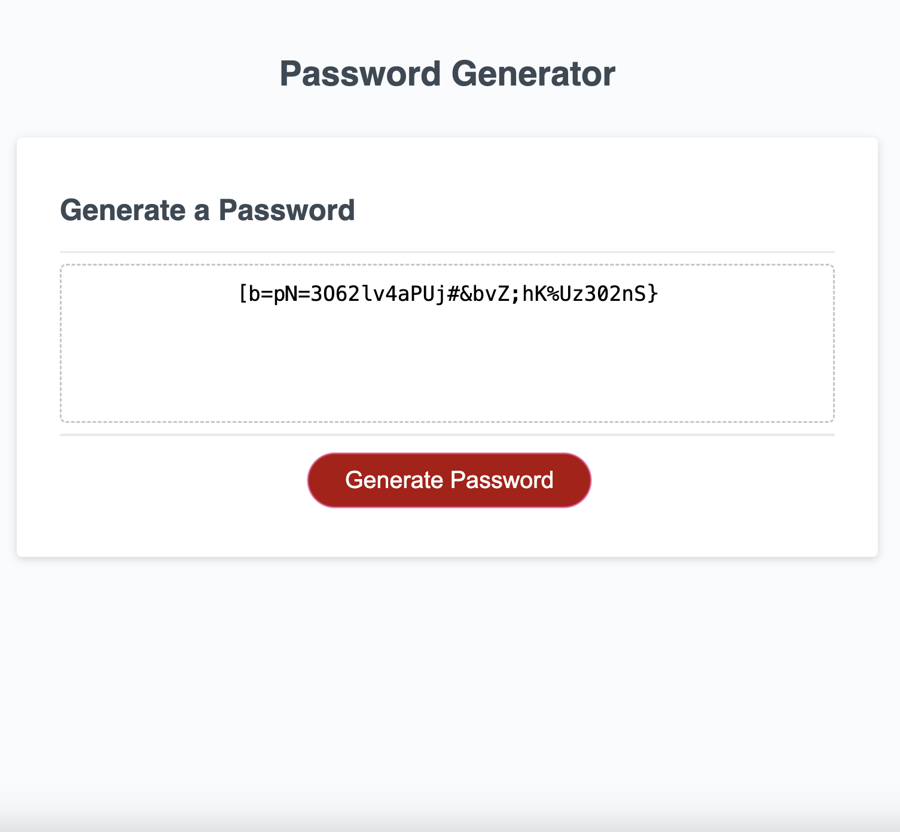

# password-generator

A Random Password Generator

## Description

This website a random password generator. It's purpose is to give people security while on the web. This password generator provides the option of choosing the length of 8-128. The character types they can choose include numbers, special characters, letter, and uppercase letters.

## Installation

N/A

## Usage

To get started click on the "Generate Password" button. From here you will be asked how long your password to be. Type the number you want. After you will be asked whether you want numbers, special characters, or letters in your password. Once all prompts are answered, the new password will appear in the box. Here is the link for full access https://judy-her.github.io/password-generator/

## Credits

I had help from UCB Xpert Learning Assistant AI. I got the code to chck if my array was the the same length as the text input.
I used the Fisher-Yates shuffle algorith which was explained by nobledesk.com.

## License

Please refer to LICENSE in the repo.
